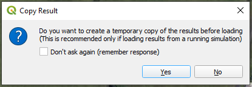
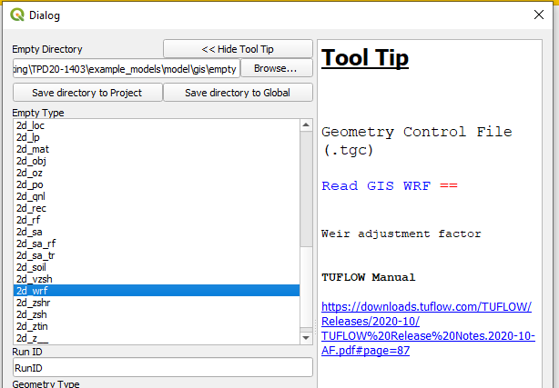
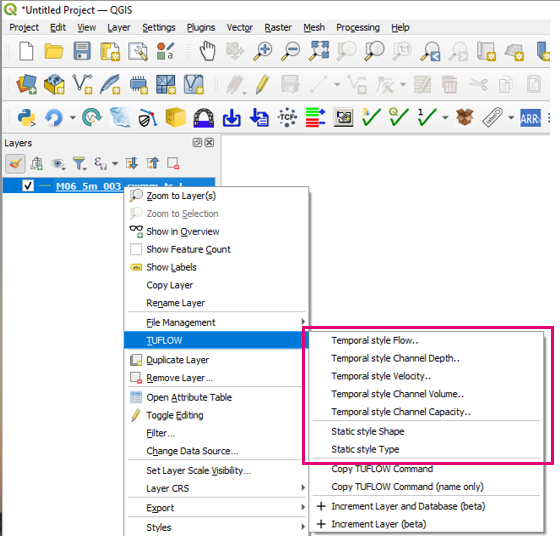
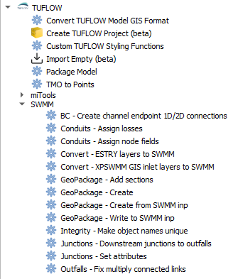
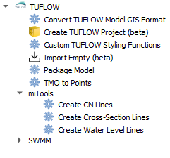
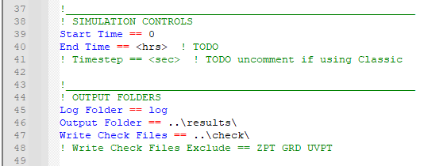
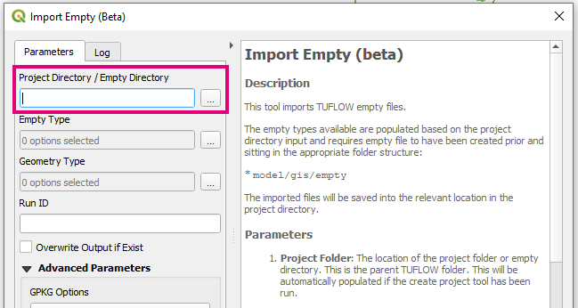

# Changelog for TUFLOW Plugin v3.10

* TOC
{:toc}

<!--
<video style="max-width:640px" controls>
  <source src="assets/test.mp4" type="video/mp4">
</video>
-->

## New Features and Enhancements

### TUFLOW Viewer

##### Support for TUFLOW-SWMM Results
{: .fs-4 : .fw-700}

Support for the new GPKG time-series output format (_swmm_ts.gpkg) has been added and can be loaded via:

* Load Results *(via the TLF or TCF)*
* Load Results - Time Series

For more information on the format please visit the TUFLOW Wiki: 
[TUFLOW Viewer - GPKG_Time_Series_Format](https://wiki.tuflow.com/TUFLOW_Viewer#GPKG_Time_Series_Format)

<video style="max-width:640px" controls>
  <source src="assets/swmm_gpkg_ts.mp4" type="video/mp4">
</video>

##### Support for NetCDF Rasters in Animation Tool
{: .fs-4 : .fw-700}

Support for NetCDF rasters (including high-resolution NC outputs) has been added to the animation export tool. The rasters must be loaded via: 
Load Results - NetCDF Grid

<video style="max-width:640px" controls>
  <source src="assets/nc_hr_animation.mp4" type="video/mp4">
</video>

##### New Option to Copy Results Before Loading
{: .fs-4 : .fw-700}

The option to create a temporary copy of the results before loading them has been added. This negates the issue of locked result files while trying to view results while TUFLOW is running. This is applicable for XMDF, DAT, and NetCDF results.

For more information, please visit the following TUFLOW wiki page: 
[TUFLOW Viewer - Loading Results While TUFLOW is Running](https://wiki.tuflow.com/TUFLOW_Viewer_-_Loading_Results_While_TUFLOW_is_Running)

##### Selecting 1D Nodes Does No Longer Affects 1D Long Sections
{: .fs-4 : .fw-700}

Selecting 1D nodes while plotting a 1D long section no longer affec the long section (i.e. cause it to disappear).

<video style="max-width:640px" controls>
  <source src="assets/long_plot_remaining.mp4" type="video/mp4">
</video>

##### Unchecking a Mesh Result in the Layers Panel No Longer Causes Result to be Deselected
{: .fs-4 : .fw-700}

Unchecking a mesh layer (e.g. XMDF) in the QGIS Layers Panel will no longer deselect the result in TUFLOW Viewer in the 'Open Results' widget. This was previously implemented because there was a bug in QGIS that would cause results to remain visible even after they were deselected in TUFLOW Viewer due to the F7 styling panel 'Live Update' option overriding TUFLOW Viewer (to fix this the Open Results widget was linked to the checked layer visibility).

### Import Empty

##### Adds Missing Tooltips
{: .fs-4 : .fw-700}

Missing tooltip for the 2d_wrf type added.

### TUFLOW Context Menu

##### GPKG Time Series Result Styling
{: .fs-4 : .fw-700}

Styling by different result types has been added to the GPKG time-series result context menu. This is possible regardless of whether the layer has been opened via TUFLOW Viewer or opened in QGIS natively.

### Processing Toolbox

##### SWMM Tools
{: .fs-4 : .fw-700}

A toolbox containing a number of tools for TUFLOW-SWMM model building has been added. For more information please visit the following TUFLOW wiki page: 
[TUFLOW QGIS Plugin](https://wiki.tuflow.com/TUFLOW_QGIS_Plugin)

##### MiTools
{: .fs-4 : .fw-700}

A toolbox containing a number of ported MiTools has been added.

##### Create TUFLOW Project Missing Commands
{: .fs-4 : .fw-700}

Missing commands from the TCF has been added to the control file templates created when running the Create TUFLOW Project tool. The missing commands were:

* <tt>Start Time ==</tt>
* <tt>End Time ==</tt>
* <tt>Timestep ==</tt>
* <tt>Log Folder ==</tt>
* <tt>Output Folder ==</tt>
* <tt>Write Check Files ==</tt>

##### Import Empty Supports Empty Folder or Project Folder
{: .fs-4 : .fw-700}

The import empty toolbox tool now supports the empty directory to be either the project directory (TUFLOW folder) or the empty directory itself. If using the project directory, the directory structure must match the standard TUFLOW structure.

## Bug Fixes

### TUFLOW Viewer

* Disable matplotlib 3.5.1 "legend about to break" check and message
* Fixes bug where Flood Modeller cross-sections weren't plotting due to the change in inactive area handling in TUFLOW Plugin v3.9
* Fixes bug when loading a cross-section that starts with a valid float number in the header
* Fixes python error that prevented TUFLOW Viewer from loading when there was a 1d_xs
* Fixes hover over plot labelling for matplotlib 3.7
* fixes a bug that stopped loading tpc result when a '#' was present in the flow regime result
* Removes duplicate result types from 2d_bc_tables
* Static NetCDF grid results no longer affect the time slider
* Optimised code relating to feature selection when viewing time series results
* Long profile results are not shown if only 2D results are available (Time Series results)

### Other

* Import Empty (Toobox) - Fixes bug that could potentially not correctly bring in new GPKG layer if GPKG contained more than one layer
* Import Empty (Toolbox) - Removes duplicate empty types from list
* Apply GPKG Name - Fixes bug where name wasn't applied to raster layers where the database only containes one raster layer
* Increment Layer - Fixes bug that would cause python error if a layer group was selected
* Convert TUFLOW Model GIS Format - Fixes bug on tool initialisation when using network drivers (caused python error)
* Load from TCF - Fixes python error that would occur if an xf layer was being referenced
* 1D Integrity Tool - Vector layer input comboxes will no longer reset if a layer is added/removed from workspace
* 1D Integrity Tool - Error is shown to user if selected channels are not connected when using the flow trace tool. Previously this would error silently and progress bar looked to hang.
* 1D Integrity Tool - Remembers selected DEM which could reset if layers were added/removed from workspace
* 1D Integrity Tool - Fixes python error that could occur if an aerial image was accidentally used as ground surface
* Run TUFLOW - Fixes bug that can cause Python error when browsing for TUFLOW.exe
* Copy TUFLOW Command - A little more clever when searching for control files in case it finds an erroneous 'TUFLOW' folder
