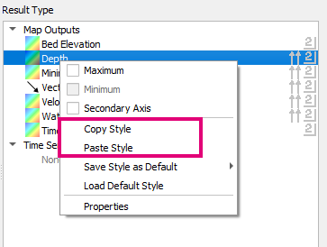
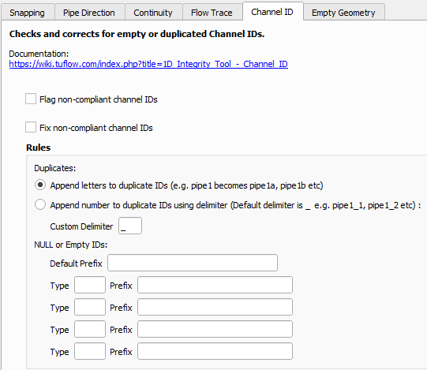
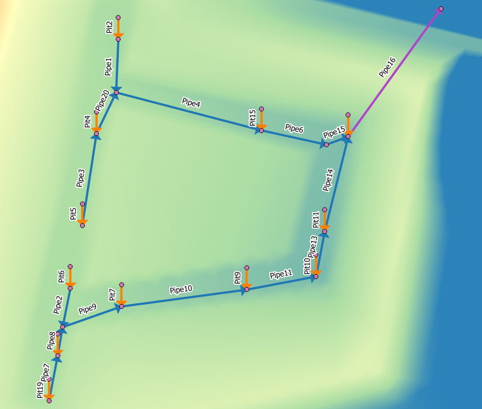
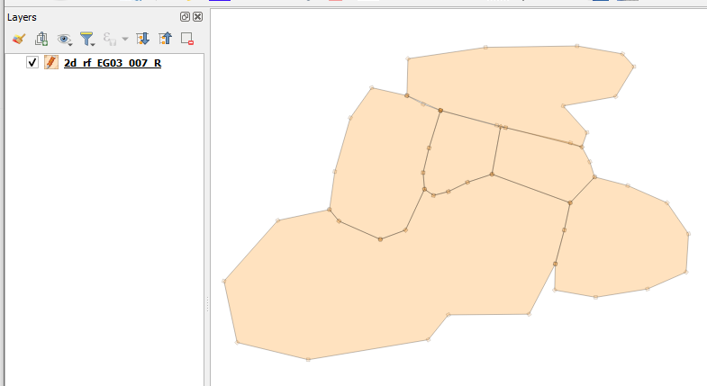

# Changelog for TUFLOW Plugin v3.2

* TOC
{:toc}

## New Features and Enhancements

### TUFLOW Viewer

##### Support For Copy / Paste Styling
{: .fs-4 : .fw-700}

An option to copy and paste scalar and vector styling within TUFLOW Viewer using the context menu in the Result Types widget.

##### Changing Icon Size
{: .fs-4 : .fw-700}

Icon size can now be changed in TUFLOW Viewer >> Setting >> Options. Icon size should also be corrected for Ultra HD monitors (if one Ultra HD monitor and one non-Ultra HD monitor are both connected, then there may still be issues).

##### Hover Over Pipe Labelling
{: .fs-4 : .fw-700}

Hover over pipe labels has been added to the cross-section plotting tab when viewing 1D long profiles.

<video style="max-width:640px" controls>
  <source src="assets/tv_pipe_labels.mp4" type="video/mp4">
</video>

##### 1D Long Plot Along Non-Primary Flow Paths
{: .fs-4 : .fw-700}

Long sections from 1D results now allow users to generate sections along non-primary flow paths by selecting an upstream and downstream section to go between. Previously TUFLOW Viewer relied on the information provided in the `plot/csv/_1d_Chan.csv` which only described connections along primary flow paths.

##### Cross-Section Refresh Reloads CSV
{: .fs-4 : .fw-700}

If the cross-section CSV source file is missing, copying the CSV to correct location and refreshing the plot will now correctly reload from CSV.

##### Plotting Icons Added To Tab Headers
{: .fs-4 : .fw-700}

Added icons to plotting tab headings. Changed long-profile icon for time series results to be the cross-section icon to match plotting tab.

### 1D Integrity Tool

##### Empty Geometry Tool
{: .fs-4 : .fw-700}

Added new tool: Empty Geometry (find and remove).

For more information, please visit the following TUFLOW wiki page: 
[1D Integrity Tool - Empty Geometry](https://wiki.tuflow.com/1D_Integrity_Tool_-_Empty_Geometry)

##### Duplicate / Missing IDs
{: .fs-4 : .fw-700}

Added new tool to find and fix duplicate IDs or empty IDs.

For more information, please visit the following TUFLOW wiki page: 
[1D Integrity Tool - Channel ID](https://wiki.tuflow.com/1D_Integrity_Tool_-_Channel_ID)

##### Pre-Tool Check
{: .fs-4 : .fw-700}

A check has been added before all the integrity tools that stops the tool from running if there are duplicate or empty IDs, or empty geometries, as this can cause errors or funny behaviour in most of the tools.

##### Output Consistent Naming Convention
{: .fs-4 : .fw-700}

All tools now have a consistent naming convention for corrected output layers - 'original_lyr_name_tmp'.

### Import Empty

##### Missing Tooltip Empty Types
{: .fs-4 : .fw-700}

Tooltips updated to include some missing empty types and updated to link to the 2018 Manual.

##### Save Empty Directory
{: .fs-4 : .fw-700}

The ability to save the current empty directory to the project or globally is now available.

### Auto Labelling

##### PLOT_P and PLOT_L
{: .fs-4 : .fw-700}

Added _PLOT_L and _PLOT_P custom label rules.

### Insert TUFLOW Attributes

##### Save Empty Directory
{: .fs-4 : .fw-700}

The ability to save the current empty directory to the project or globally is now available.

### Load Layers From TCF

##### GPKG Now Supported
{: .fs-4 : .fw-700}

Now supports GPKG vector and raster format.

##### GeoTIFF Now Supported
{: .fs-4 : .fw-700}

Now supports TIF raster format.

### TUFLOW Layer Styling

##### 2d_rf
{: .fs-4 : .fw-700}

Added 2d_rf style.

##### 2d_sa Transparent
{: .fs-4 : .fw-700}

Updated 2d_sa style to have more transparency.

## Bug Fixes

### TUFLOW Viewer

* Save default style fixed
* Load scalar and vector datasets correctly for xmdf results outside of velocity and unit flow
* Fixed bug in time series results that could load groundwater results incorrectly as surface results e.g. 'groundwater level' as 'level'
* Fixed bug that could cause python error or unusual plotting behaviour if time series results was removed then re-added with updated/different output types
* Fixed bug that user to have to deselect result in 'Results' list a couple of times to toggle it off after loading time series results only [similar to bug fixed in 3.1.10]
* Fixed bug that would cause Python error when plotting 'US Level' or 'DS Level' when a point object from PLOT_P was also selected
* Default font size is now correctly shown in options dialog after it is changed without having to restart TUFLOW Viewer
* Fixed bug that could occur when loading from a project can cause Python error when time series results are in the project
* Fixed bug that could cause water level results to not appear on cross-section
* Fixed bug for viewing cross-section that would not correctly handle column names in the GIS layer
* Time series long plot will now check for circular references in the 1D channel system. Previously this could cause QGIS to hang.

### Other

* Import Empty Tool - Fixed and issue where older versions of QGIS (older than 3.10.3) had stopped working due to the use of new modern methods.
* Increment Layer Tool - Fixed and issue where older versions of QGIS (older than 3.10.3) had stopped working due to the use of new modern methods.
* TUFLOW Styling - Fixed bug that would cause a Python error if no layer was selected
* Load from TCF - Fixed bug that would cause Python error when a command had '==' as a comment.
