# Changelog for TUFLOW Plugin v3.3

* TOC
{:toc}

## New Features and Enhancements

### General

GPKG compatibility added to relevant tools - Functionality added for the 2022 TUFLOW release. Significant updates have been made to the 1D integrity tool.

### TUFLOW Viewer

##### New 'Load From TCF' Approach
{: .fs-4 : .fw-700}

New approach when loading from TCF - all possible results listed to user rather than possible scenarios. The old method is still available via Settings >> Defaults.

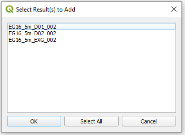

##### Support For New Method For Setting Axis Limits in Animation Export Tool
{: .fs-4 : .fw-700}

Setting axis limits for cross-section plots have a new method where the limits are taken from the TUFLOW Viewer plot. Opening plot properties will no longer trigger axis limit calculation which could sometimes take a while.

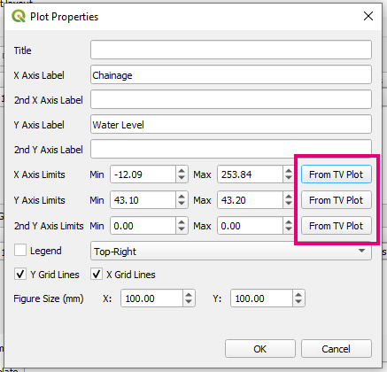

##### Hover Over Open Channel Labelling
{: .fs-4 : .fw-700}

Hover over labelling shows channel names in 1D results long plotting - similar to culvert hover over labelling.

<video style="max-width:640px" controls>
  <source src="assets/channel_labelling.mp4" type="video/mp4">
</video>

##### Speed Up Hover Over Labelling
{: .fs-4 : .fw-700}

Use blitting to make hover over labelling a lot quicker.

### Processing Toolbox

A TUFLOW toolbox has been added to the processing tool.

##### Convert TUFLOW Model GIS Format
{: .fs-4 : .fw-700}

Added "Convert TUFLOW Model GIS Format" tool.

### Apply GPKG Layer Names

New Tool - renames GPKG layers in QGIS Layers Panel to match their name in the GPKG database.

### TUFLOW Layer Styling

###### GPKG Support
{: .fs-4 : .fw-700}

Now supports GPKG layers.

### Import Check Files

###### GPKG Support
{: .fs-4 : .fw-700}

Now supports GPKG layers.

### Import Empty Files

###### GPKG Support
{: .fs-4 : .fw-700}

Now supports GPKG layers.

### Insert TUFLOW Attributes

###### GPKG Support
{: .fs-4 : .fw-700}

Now supports GPKG layers.

### Configure Project

###### GPKG Support
{: .fs-4 : .fw-700}

Now supports GPKG layers.

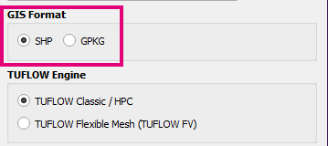

### About Dialog

QGIS and Python version also listed.

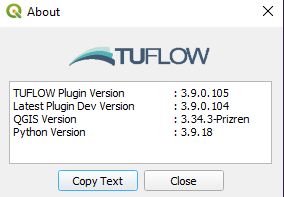

### Integrity Tool

###### Additional 'Magnitude' Column in Output
{: .fs-4 : .fw-700}

Added additional 'magnitude' column to 'output' GIS layer that defines how far big the error is based on respective tool (bigger magnitude = bigger issue).

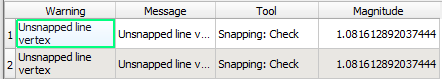

###### Auto Styling for Output
{: .fs-4 : .fw-700}

Added auto symbology for the 'output' GIS layer that uses a graduated size based on the 'magnitude'. This is automatically applied when the layer is generated and can also be applied via the TUFLOW layer styling tool.

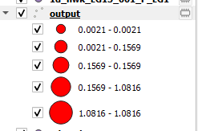

###### Option to Auto Replace Input With Output
{: .fs-4 : .fw-700}

After a given tool is run, if corrections were made and option will be given to automatically replace inputs with tool outputs after running.

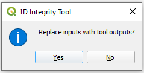

###### Udated GUI With Documentation Links
{: .fs-4 : .fw-700}

The GUI has been updated with links to documentation for the relevant tool.

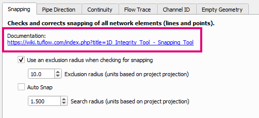

###### Output 'tmp' Layers Given Same Style as Input
{: .fs-4 : .fw-700}

Output, correct, layers automatically copy the style of input layers.

###### Flow Trace Speed Up
{: .fs-4 : .fw-700}

Significantly improved the speed of the long plot generator in the flow trace tool - will be most noticeable on big datasets.

###### Limit Flow Trace Between Channels
{: .fs-4 : .fw-700}

Can now limit flow trace and long plot to particular section of network by selecting 2+ channels to connect between.

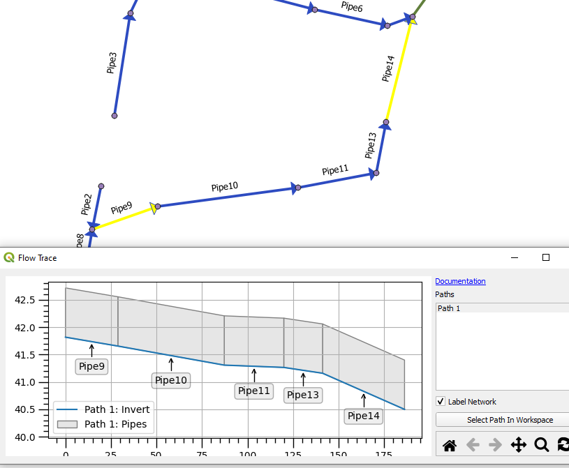

###### Long Plot - Hover Over Labelling Shows More Info
{: .fs-4 : .fw-700}

Hover over labelling now shows more information on the channel/pipe and any continuity flags.

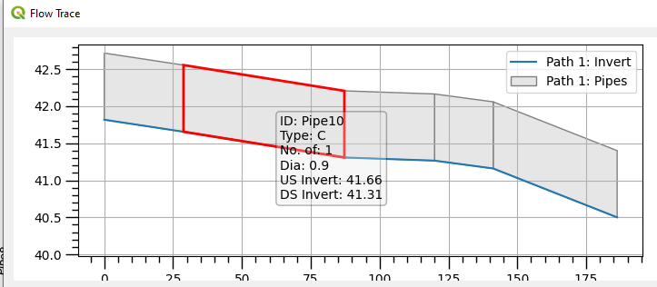

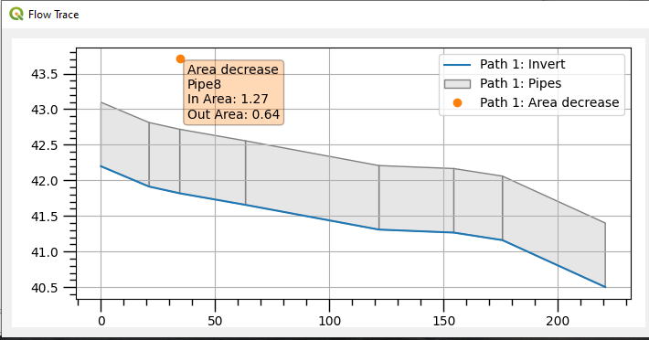

###### Long Plot - Copy / Export Data
{: .fs-4 : .fw-700}

Export/copy data options to the context menu.

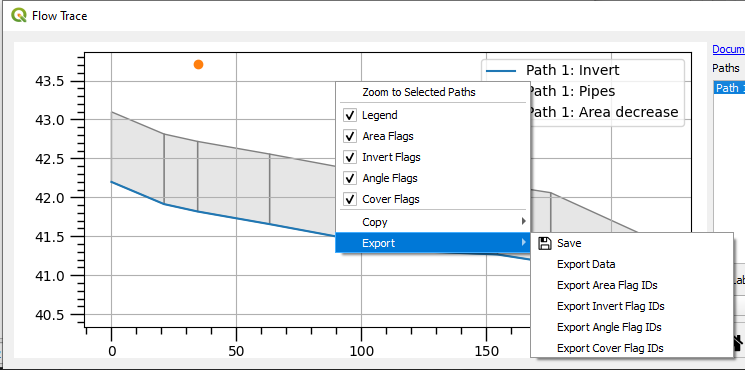

###### Long Plot - Hide Legend
{: .fs-4 : .fw-700}

Toggle legend on/off option available in the context menu.

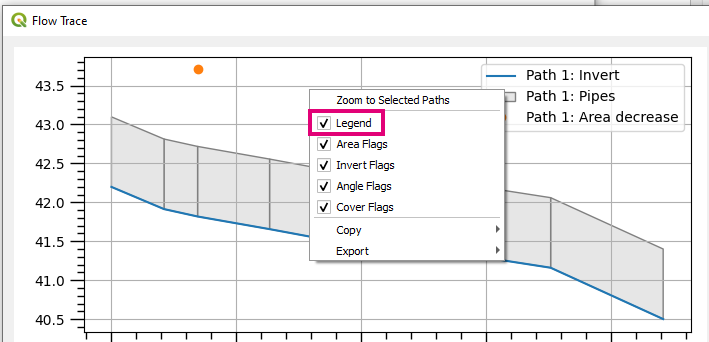

###### Long Plot - Toggle Different Continuity Flags
{: .fs-4 : .fw-700}

Toggle different continuity flags on/off option available in the context menu.

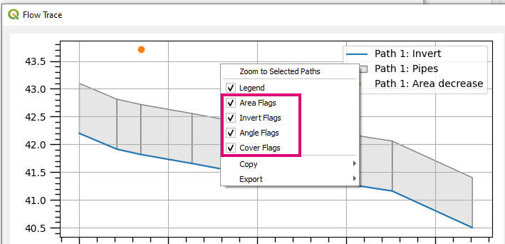

###### Long Plot - Plot Window Link with Map Window
{: .fs-4 : .fw-700}

Current pipe at mouse position in the plotting window is highlighted red in QGIS map window.

<video style="max-width:640px" controls>
  <source src="assets/pipe_integrity_long_plot_map_link.mp4" type="video/mp4">
</video>

###### Long Plot - Zoom to Channel in Map Window
{: .fs-4 : .fw-700}

'Zoom to feature' option added to the context menu (if a channel has been right-clicked) that will zoom the map window to the selected channel.

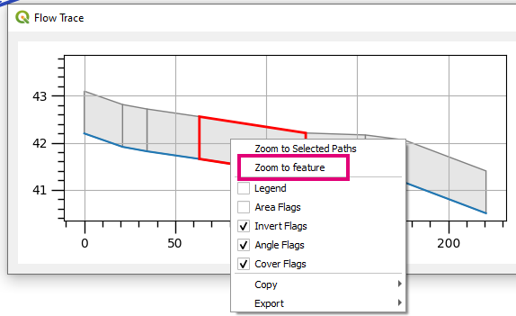

###### Long Plot - Zoom to Path in Map Window
{: .fs-4 : .fw-700}

'Zoom to Selected Paths' option added to the context menu that will zoom the map window to the selected paths in the 'Paths' widget.

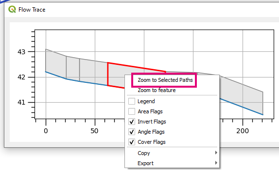

###### Long Plot - Better Label Conflict Management
{: .fs-4 : .fw-700}

Channel labelling have better conflict management so that there is little to no overlaps.

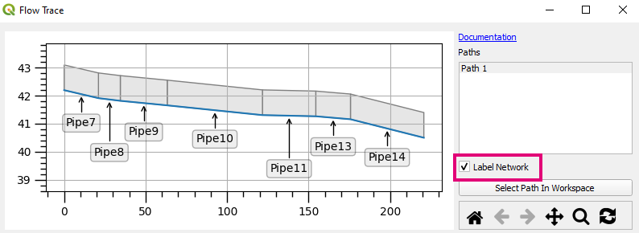

## Bug Fixes

### TUFLOW Viewer

* Orevent scrambling of datasets in plot window due to bug in matplotlib 3.5.1 (packaged with QGIS 3.24.1)
* Colour bar is now always displayed for curtain plot (if legend is on) - previously if there was no data (i.e. section was dry) the colour bar wasn't shown. Mostly affects animations.
* Fixed colour bar label which broke with an update to the matplotlib library
* TUFLOW FV XMDF outputs now will correctly show maximums
* Fixed bug that could cause Python error if _PLOT_ layers were removed from workspace while TUFLOW Viewer was closed
* Fixed bug with icon size setting introduced in v3.2 for QGIS versions < 3.16 that would cause error when trying to load
* Hover over labelling is broken in latest QGIS python/matplotlib version - now fixed
* Fixed bug that could occur when loading from a qgz/qgs

### Other

* ReFH2 Tool - fixed bug that broke ReFH2 GUI from opening in previous release
* Import Empty - TUFLOW empty type list will be properly updated after user uses 'browse' to select a directory
* Insert TUFLOW attributes - TUFLOW empty type list will be properly updated after user uses 'browse' to select a directory
* Configure Project - Displayed paths now show correct operating system slashes
* TUFLOW utilities - Common functions - can now specify an output name without specifying an output directory
* TUFLOW utilities - Common functions - output name in TUFLOW_to_GIS was not working
* 1D Integrity Tool - No longer need a line layer to check for empty geometries in points or cross section layers
* Load From TCF - Will now load layers from 'Create TIN Zpts' command
* Auto Label - Fixed tooltip when mouse hovers over toolicon in plugin toolbar
* SCS Tool - now unloads properly
* TUFLOW Menu under Plugins - now unloads properly
