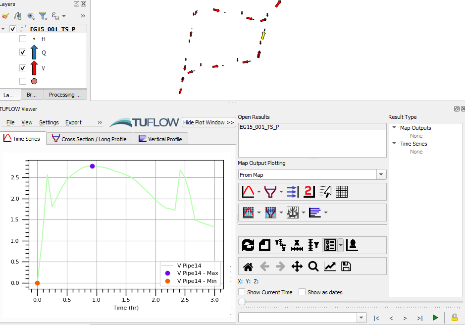
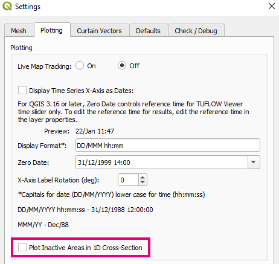
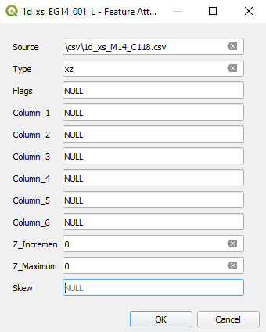
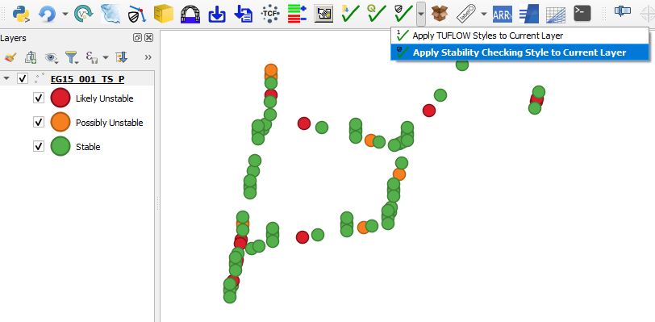
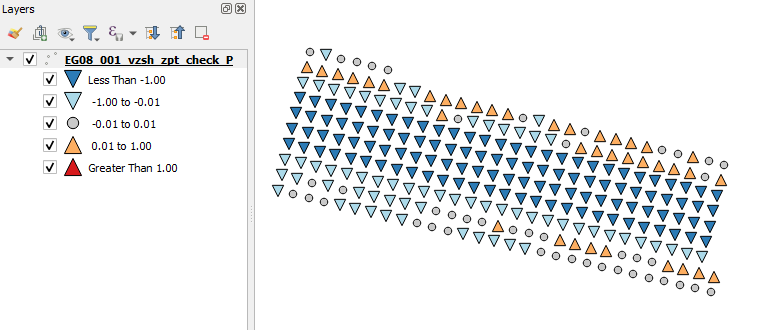
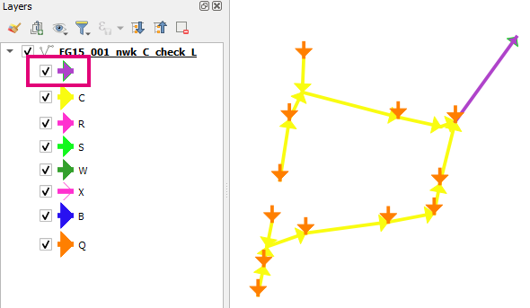
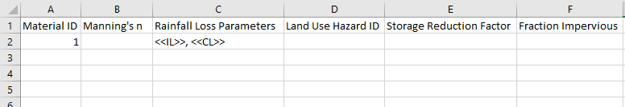
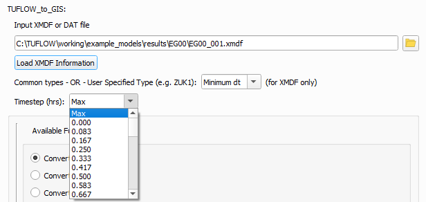

# Changelog for TUFLOW Plugin v3.4

* TOC
{:toc}

## New Features and Enhancements

### TUFLOW Viewer

##### Support for '_TS_P' GIS Outputs
{: .fs-4 : .fw-700}

Support for "quick viewing" '_TS_P' output GIS layers (just open them in QGIS while TUFLOW Viewer is open). Not full featured (no axis names, does not populate time slider, no secondary axis etc).

##### Toggle Inactive Areas in Cross-Sections
{: .fs-4 : .fw-700}

User option added to view/hide inactive areas in 1D cross-sections. In-active areas are controlled by negative material/mannings n values in the cross-section.

##### Cross-Section Source Leading With '/'
{: .fs-4 : .fw-700}

Cross-section source reference with a leading '/' (or '\\') will now be interpreted the same as './'. Although this not correct (e.g. "./csv/cross_section.csv" is different than "/csv/cross_section.csv" especially in Linux), this is how TUFLOW currently handles leading slashes.

##### Support For Insets in Animation Export Tool
{: .fs-4 : .fw-700}

Animation export tool will now update temporal properties of all map windows in the print layout (i.e. support for insets).

<video style="max-width:640px" controls>
  <source src="assets/inset.mp4" type="video/mp4">
</video>

### 1D Integrity Tool

##### Error Downgraded to Warning When Input Checking
{: .fs-4 : .fw-700}

Now produces a warning instead of an error if the input layer doesn't look like a 1d_nwk type

### TUFLOW Layer Styling

##### Stability Styling
{: .fs-4 : .fw-700}

A new styling button is located using dropdown arrow under 'Style Current Layer' button. This will automatically style the '_TS_P' layer based on perceived stability.

##### VZSH_ZPT_CHECK
{: .fs-4 : .fw-700}

Styling for vzsh_zpt_check.

##### NWK_C Check 'all else' On By Default
{: .fs-4 : .fw-700}

NWK_C check styling now has purple "all else" style visible by default.

### ARR to TUFLOW

##### Assume Zero Values for NaN
{: .fs-4 : .fw-700}

If storm loss values are NaN from the datahub, the tool will now assume zero and produce an warning message in the output log file.

##### Additional Columns Added to Material.csv
{: .fs-4 : .fw-700}

Added additional columns ("Storage Reduction Factor" and "Fraction Impervious") to material.csv output.

### TUFLOW Utilities

##### Increased Dropdown Box Width
{: .fs-4 : .fw-700}

Increased width of timesteps dropdown box for "TUFLOW to GIS" common tools.

## Bug Fixes

### TUFLOW Viewer

* Fixed bug that caused map to not update when clicking different result types after loading from a project
* Fixed a bug that was converting all length units to metres for 2D/3D cross-section plotting - will now use map canvas units
* Fixed a bug that would incorrectly show the maximum water level on 1D cross-sections
* New method of loading result from TCF was sometimes incorrectly loading in results that weren't selected by the user

### Other

* Import Empty - Fixed bug when choosing option to 'Convert to GPKG' that wouldn't correctly create a GPKG layer with TUFLOW attributes or projection
* Load Layers From TCF - fixed loading GPKG layers that would sometimes fail to load
* Configure Project - Fixed 'OK' button that was disabled within the select CRS dialog
