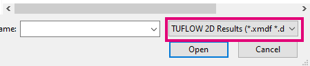

# Changelog for TUFLOW Plugin v3.5

* TOC
{:toc}

## New Features and Enhancements

### TUFLOW Viewer

##### Load Results From TCF - Appended Scenario / Event Names
{: .fs-4 : .fw-700}

Load results from TCF now finds results that have appended scenario/event names.

##### Changed Mesh Format Order in Load Dialog
{: .fs-4 : .fw-700}

The mesh format (extension) order has been changed in the **Load Results - Map Outputs** dialog so that XMDF is now listed first.

### ARR to TUFLOW

##### Sets Initial Losses > 72 hrs
{: .fs-4 : .fw-700}

Sets initial losses > 72hrs to the 72 hr initial loss value.

### Load Layers From TCF

##### New Raster Options
{: .fs-4 : .fw-700}

The user now has the option to load rasters, not load rasters, or load them but don't render them (start unchecked in the Layers Panel).

## Bug Fixes

### TUFLOW Viewer

* Fixes animation export

### Other

* Import Empty - ensures the .prj file of the imported empty is the same as the empty - this was previously implemented but was recently broken in v3.4
* Configure Project - Was not correctly setting the empty directory in the Import Empty and Insert TUFLOW Attributes tool if the 'Save to Project' or 'Save Globally' was used in either tool.
* ARR to TUFLOW - Fixes a bug when selecting 'Use Event Independent Continuing Losses' that would cause the variable setting TRD file to become scrambled.
