# Changelog for TUFLOW Plugin v3.6

* TOC
{:toc}

## New Features and Enhancements

### TUFLOW Viewer

##### Curtain Plots Support Vertical Velocity
{: .fs-4 : .fw-700}

TUFLOW FV NetCDF curtain vectors will now have a vertical component if a 'W' output is found in the results.

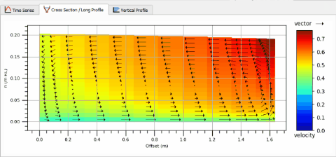

##### Support For Changing Result Order
{: .fs-4 : .fw-700}

Added option to shift order of open results via right-click context menu. This is useful for changing the order results appear in the plotting window.

<video style="max-width:640px" controls>
  <source src="assets/change_result_order.mp4" type="video/mp4">
</video>

##### Remember Previous State for GUI Layout
{: .fs-4 : .fw-700}

An option to remember the previous state of the TUFLOW Viewer layout has been added. This remember whether the previous state was using the 'Plot View', 'Narrow View', and where the dock was located.

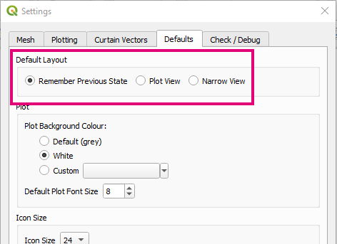

##### Support For NetCDF Rasters
{: .fs-4 : .fw-700}

NetCDF rasters are now supported via **Load Results - NetCDF Grid**.

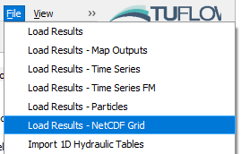

##### Support For Flood Modeller Python Exported Results
{: .fs-4 : .fw-700}

Added support for CSV results exported from the Flood Modeller API Python library (**Load Results - Time Series FM**).

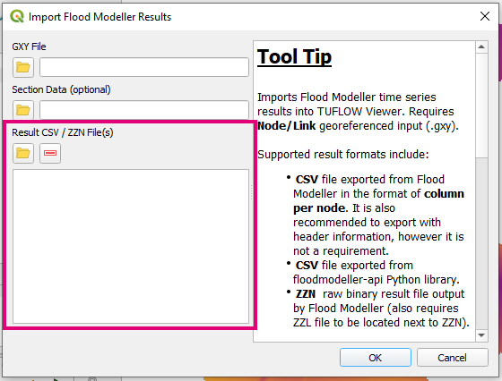

##### Support For ZZN Flood Modeller Results
{: .fs-4 : .fw-700}

Adds support for the raw ZZN time series output from Flood Modeller (**Load Results - Time Series FM**).

### SCS to TUFLOW

##### New Approach to Use GIS Polygons
{: .fs-4 : .fw-700}

New approach added that uses GIS polygon(s) and their attribute data for method calculation. This has the benefit of allowing multiple calculations to take place and spatial distribution of parameters.

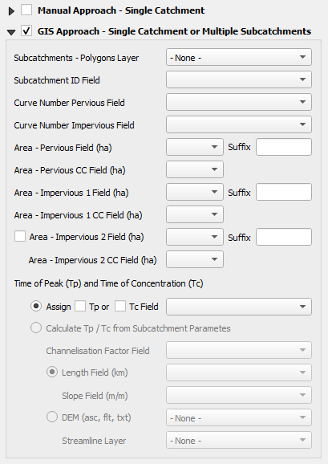

### Load Layers From TCF

##### Progress Bar
{: .fs-4 : .fw-700}

A progres bar has been added. This shows users where the tool is being slow at loading (usually large DEMs).

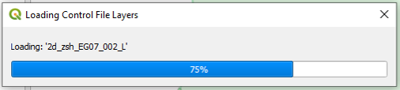

##### Automatic TUFLOW Styling
{: .fs-4 : .fw-700}

Imported layers are automatically given TUFLOW styling.

<video style="max-width:640px" controls>
  <source src="assets/load_tcf_layers_styling.mp4" type="video/mp4">
</video>

##### Grouping Options
{: .fs-4 : .fw-700}

An option has been added to give users the ability to choose whether to bring in layers 'grouped' or 'ungrouped' by control file.

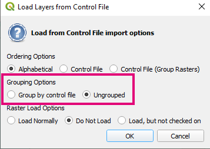

### Sort / Filter Open Layers

##### Improved Sorting Algorithm
{: .fs-4 : .fw-700}

The sorting algorith has been altered slightly so that layers with the same name (w/o '_L', '_P', '_R' suffix) will be sorted by geometry in order of points, line, polygon. The tool's speed at sorting layers has also been improved.

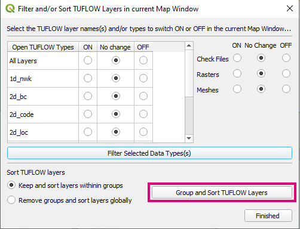

### Convert TUFLOW Model GIS Format

##### Restrict Conversion by Scenario
{: .fs-4 : .fw-700}

Provides user with the option to restrict conversion by scenario name.

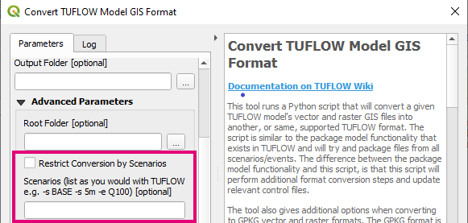

### Configure TUFLOW Project

##### New Icon
{: .fs-4 : .fw-700}

New icon and added to toolbar.

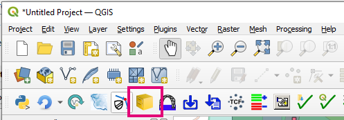

### TUFLOW Layer Styling

##### Adds Missing Styles
{: .fs-4 : .fw-700}

Added styling for 2d_qnl layers.

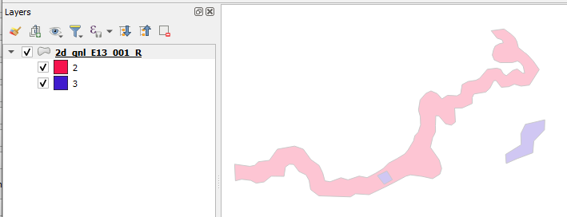

### TUFLOW Utilities

##### Auto Find 2dm
{: .fs-4 : .fw-700}

TUFLOW to GIS will automatically find the 2dm file if using a post-processed XMDF.

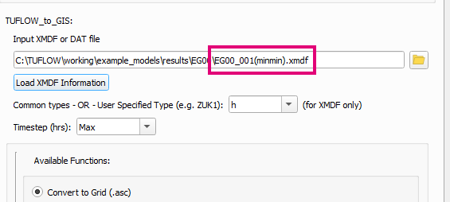

## Bug Fixes

### TUFLOW Viewer

* Cross-section plot lines could become offset if start or end of line was outside the mesh
* Fixes bug for long section plotting of Flood Modeller results that could sometimes produce a python error
* Fixes bug in hiding inactive area on cross-section when M column header isn't defined in GIS file
* Fixes bug with cross-section plot that wouldn't update plot when a result type was deselected
* Fixes bug when loading results from TCF which could produce a python error when ~s~ flag was just before extension .tcf in the name
* Fixes 'load results from TCF' when output path is an absolute path
* Fix bug when loading TUFLOW release 2013 time series results which could produce a python error
* New method for loading results from TCF backported to be compatible with Python versions earlier than 3.9 and QGIS versions earlier than 3.22

### Other

* 1D Integrity Tool - Fixes a bug with the ouput symbol renderer in QGIS 3.26
* TUFLOW Utilities - Fixes bug with TUFLOW to GIS common tool using correct scalar/vector type and loading timesteps from a post-processed XMDF
* TUFLOW Styling - Fixes a bug that would not render TUFLOW style for GPKG layers
* Import Empty - Fixes a bug where open layers with the same name as the imported layer were removed from the workspace
* ReFH2 to TUFLOW - Fixes bug that would cause GUI to hang if 2 different output types (within rainfall or hydrograph) was selected (e.g. Direct Runoff and Total Runoff)
* ReFH2 to TUFLOW - Fixes python error that could occur if the selected GIS layer was removed
* Load From TCF - Fixes bug in new routine that wasn't finding all scenario names
