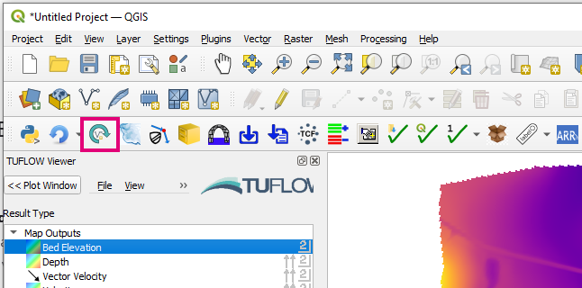
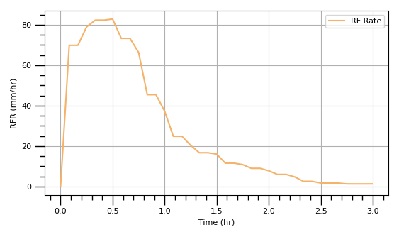
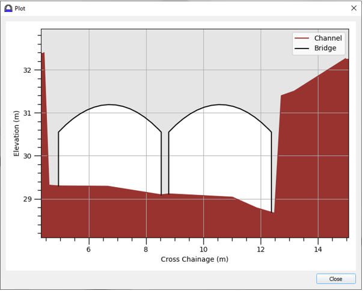
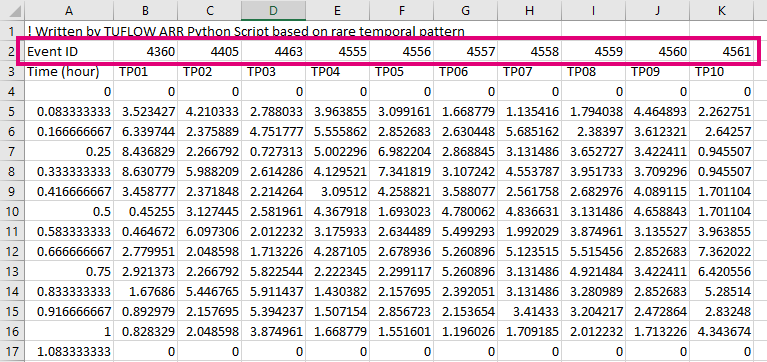

# Changelog for TUFLOW Plugin v3.7

* TOC
{:toc}

<!--
<video style="max-width:640px" controls>
  <source src="assets/test.mp4" type="video/mp4">
</video>
-->

## New Features and Enhancements

### TUFLOW Viewer

###### Updating Mesh Styling Updates Both Temporal and Maximums
{: .fs-4 : .fw-700}

Changing rendering style of a result type will now also change the style of the maximum and minimum type of the same name (and visa versa). Previously this would not update both as QGIS treats these as separate datasets.

<video style="max-width:640px" controls>
  <source src="assets/tuflow_viewer_styling_for_temp_max.mp4" type="video/mp4">
</video>

##### Support For Reloading Mesh Layers
{: .fs-4 : .fw-700}

Support reloading of mesh layers (must use reload layer tool if results have changed otherwise QGIS crashes). This is only available in QGIS 3.28+.

##### Increase Hover Over Labelling Speed
{: .fs-4 : .fw-700}

Increased hover over labelling speed. From testing 10,000 point dataset: previously each label took ~1.0s to calculate and render, now ~0.15s.

<video style="max-width:640px" controls>
  <source src="assets/labelling_speed.mp4" type="video/mp4">
</video>

##### Add Missing Plot Result Type Axis Labels and Uniots
{: .fs-4 : .fw-700}

Adds units and label to y-axis for RFR, RFC, RFML outputs.

##### Cross-Section Results Can Use Water Level or Max Water Level
{: .fs-4 : .fw-700}

Adds 'Water Level' and 'Max Water Level' result types to cross-section (previous had to use time series 'Level' result type).

<video style="max-width:640px" controls>
  <source src="assets/water_level_on_cross_section.mp4" type="video/mp4">
</video>

### Arch Bridge Editor

New tool - Arch Bridge Editor or 'BArch' types. For more information please visit the following TUFLOW wiki page: 
[QGIS TUFLOW Arch Bridge Editor](https://wiki.tuflow.com/QGIS_TUFLOW_Arch_Bridge_Editor)

### ARR to TUFLOW

##### Point Temporal Patterns
{: .fs-4 : .fw-700}

The tool will now download the point temporal pattern CSV manually if no temporal patterns are found in the ARR_Web_Data.txt.

#### CSV Output Includes Event ID
{: .fs-4 : .fw-700}

The processed rainfall CSV files now contain the temporal pattern event ID. This makes it easier to match the processed data to the raw temporal pattern data from the Datahub.

### Import Empty

##### GPKG Database Settings Saved
{: .fs-4 : .fw-700}

Database settings are now saved from previous tool runs.

### Reload Layer

##### Reload Mesh Support
{: .fs-4 : .fw-700}

Updated to support mesh layers in QGIS 3.28+.

### Load Layers From TCF

##### Improved Progress Bar
{: .fs-4 : .fw-700}

Improved progress bar.

##### Support Any TUFLOW Control Selection
{: .fs-4 : .fw-700}

Adds ability to select any TUFLOW control file to import from.

### Convert Model GIS Format

##### Manually Assigning CRS
{: .fs-4 : .fw-700}

Adds ability to specify output CRS

##### Commands That Do Not Copy Anything Reported
{: .fs-4 : .fw-700}

Tool will now log commands that do not convert/copy any files (but should do).

##### Create Empty Files
{: .fs-4 : .fw-700}

Adds option to create empty files for converted model.

##### Custom Output GPKG Name
{: .fs-4 : .fw-700}

Adds option to specify the output GPKG database name when using a grouped profile.

### Toolbox

TUFLOW toolbox added.

##### TMO to Points
{: .fs-4 : .fw-700}

Added 'TMO to Points' algorithm

## Bug Fixes

### TUFLOW Viewer

* Fixes a bug that would cause python error and not display results when trying to plot TS_P.shp and TPC results at the same time
* Fixes bug when saving project when a TS_P.shp was loaded that could cause a python error
* fixes rendering map outputs in QGIS 3.28 which could become scrambled if min dt was present (a bug is still present in QGIS that no longer renders temporal min dt)
* Fixes bug that would incorrectly carry over 1D result types to next loaded result dataset
* Stops duplicate plots of the same 1D element - can happen if the PLOT layer is duplicated in the workspace
* Fixes bug that would produce python error after closing mesh results from layers panel then trying to close 1D results
* Fixes bug in Load from TCF when a scenario name contains dashes (-)
* fixes bug in map output flow calculation which was producing a python error
* Fixes python error that could occur after closing tuflow completely and re-opening with time series result when a PLOT feature is already selected
* Unidirectional pipes now plotted correctly in long plot
* Cell centre 'bed elevation' results in TUFLOW FV netCDF format will no longer check if face is active in plot window
* Load from TCF now correctly finds output zone results
* Fixes bug that would cause 1D long sections to not plot when 1D point objects were also selected
* Fixes bug when viewing results on cross-sections with mif files that would not show water levels
* Fixed bug in animation tool that could cause python error if the dataset was the first in the mesh layer (index = 0)

### Other

* 1D Integrity Tool - fixes python error that could occur when checking for non-compliant channel ids in QGIS 3.26
* 1D Integrity Tool - Fixes bug in Unique Channel ID tool that wasn't correctly flagging non-compliant ids
* Configure Project - Fixes bug that would not create empties if 'Create Model Folder Structure' was not also ticked
* Increment Layer Tool - Handles empty geometry layers a little nicer
* Import Empty - Fixes 'Convert to GPKG' option which wasn't doing anything
* Insert TUFLOW Attributes - Fixes insert '2d_mat' when using GPKG
* Style Current Layer - Fixes tooltip
* Load From TCF - Fixes a bug that did not load layers from ECF if using "Estry Control File == AUTO"
* TUFLOW Utilities - info tool will error gracefully if an error occurs with the utility
* TUFLOW Utilities - Fixes browse dialogs hanging if previous file/folder path was on a drive that is no longer connected
* TUFLOW Utilities - Fixed bug that would crash QGIS if the download button is clicked twice in a row
* TUFLOW Utilities - Cache is now cleared for download links so latest is always downloaded
