# Changelog for TUFLOW Plugin v3.8

* TOC
{:toc}

<!--
<video style="max-width:640px" controls>
  <source src="assets/test.mp4" type="video/mp4">
</video>
-->

## New Features and Enhancements

### General

Removes most `sys.path.append` calls so that the TUFLOW Plugin doesn't get tangled with other plugins or python packages.

### TUFLOW Viewer

##### Support for Saving Default Vector Styles for Streamlines and Flow Traces
{: .fs-4 : .fw-700}

Support added for saving/loading default styling for vectors using streamline and flow trace styling.

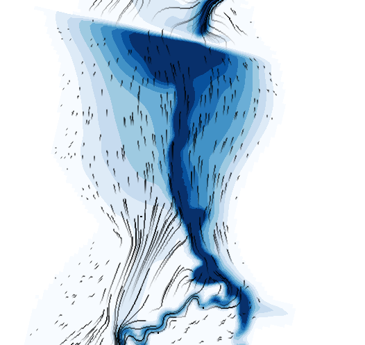

##### TUFLOW FV NetCDF Output Renders Velocity Maximums
{: .fs-4 : .fw-700}

A workaround has been added for TUFLOW FV NetCDF results so that velocity maximums are rendered properly.

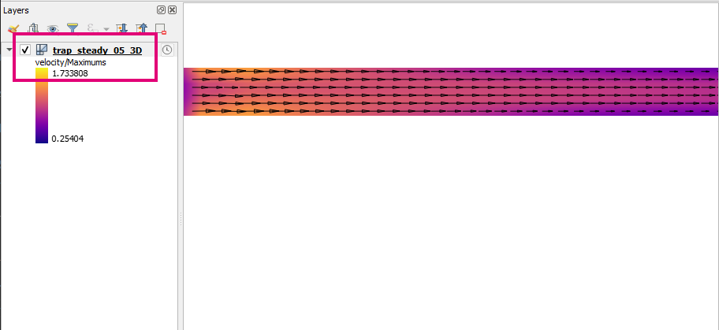

##### Adds (xs) and (nwk) to Hydraulic Table Result Types
{: .fs-4 : .fw-700}

1D hydraulic result types add "(xs)" or "(nwk)" at front of result types to indicate what part in the 1d_ta_tables_check.csv the property came from (either from the cross-section processing or from the channel network processing).

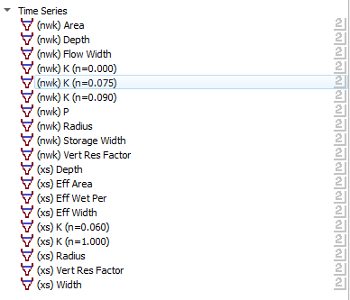

##### Adds Axis Labels for 1D Hydraulic Tables
{: .fs-4 : .fw-700}

Axis labels have been added for 1D hydraulic table plotting.

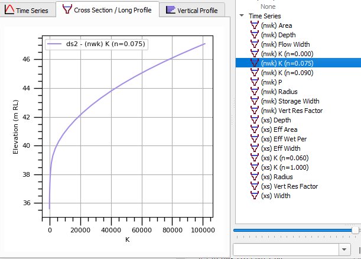

##### Adds Option to Flip Secondary Axis
{: .fs-4 : .fw-700}

The option to flip which axis has the secondary axis applied has been added to the plot context menu.

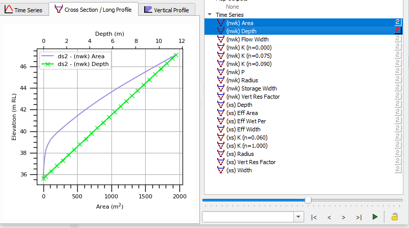

##### Animation Default Format Changed to MP4
{: .fs-4 : .fw-700}

The default output file format for the animation tool has been changed from avi to mp4.

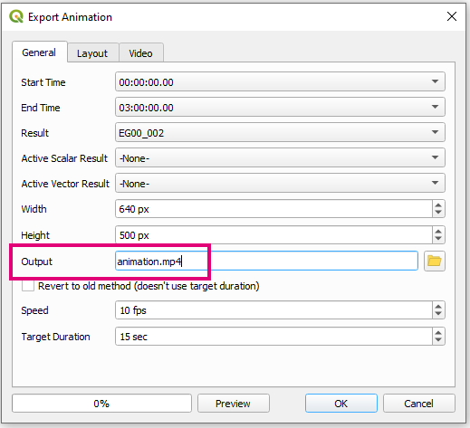

##### Better Error Handling for FFMPEG Downloader
{: .fs-4 : .fw-700}

Better error handling and reporting has been implemented when TUFLOW Viewer tries to download ffmpeg.exe for animation creation.

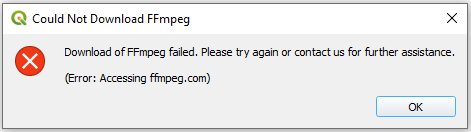

##### Adds Result Name to Filename for Cross-Section Batch Plot Exporter
{: .fs-4 : .fw-700}

The result name is added to the exported filename for batch export cross-section plot. This is the same (existing) behaviour when batch export time-series plots.

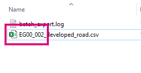

##### Support Changing Reference Time for NetCDF Raster Results
{: .fs-4 : .fw-700}

Support has been added to change the reference time for NetCDF rasters. Results must be loaded via **Load Results - NetCDF Grid**.

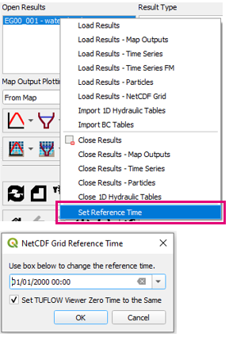

##### Open Result Widget Communicates with Layers Panel Visibility
{: .fs-4 : .fw-700}

The "Open Results" widget is now linked with the Layer Styling panel so that when results are deselected in TUFLOW Viewer the layer is simultaneously unchecked in the Layers Panel (and visa-versa). This has been implemented as there can be conflict between the QGIS F7 styling panel and TUFLOW Viewer (the QGIS panel is overriding TUFLOW Viewer) when results are deselected.

### Load Layers from TCF

##### Better Error Handling
{: .fs-4 : .fw-700}

Better error handling for issues occuring when trying to load layers from TCF into QGIS.

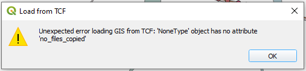

### TUFLOW Layer Styling

##### Adds Missing Layer Styling
{: .fs-4 : .fw-700}

Missing default TUFLOW layer styling has been added for bg_uvpt_check.

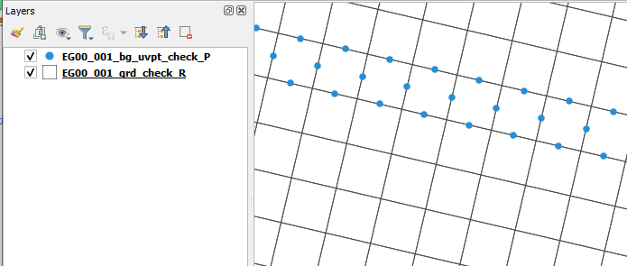

### TUFLOW Utilities

##### Adds Breakline Function to Common Functions
{: .fs-4 : .fw-700}

The ASC_to_ASC.exe utility breakline function is now available in the 'Common Functions' tab.

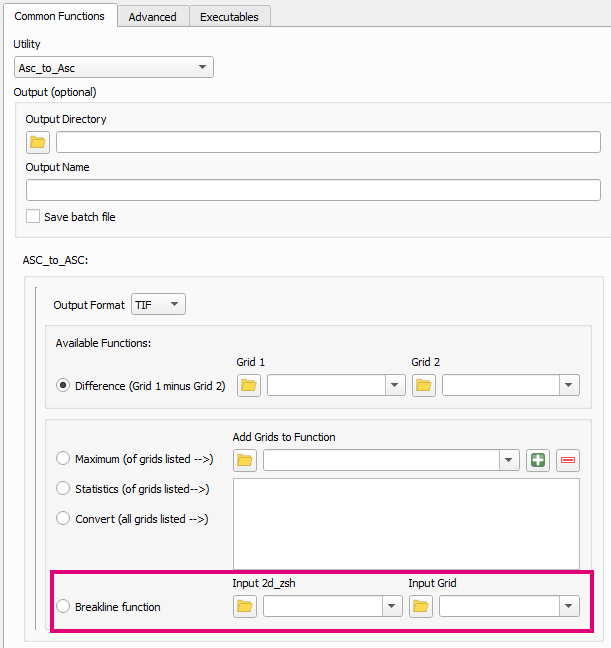

##### Adds ASC_to_ASC Version Number
{: .fs-4 : .fw-700}

The ASC_to_ASC.exe version number is presented in the lower left of the dialog. This is important as the new GIS formats are only available in 2023 releases (or later) of the tool. The version is found when the TUFLOW Utilities dialog is initially loaded and is based on the asc_to_asc.exe path in the 'Executables' tab.

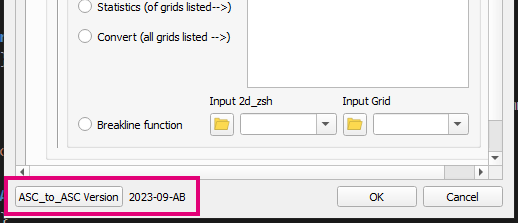

##### Adds New Output Format Options to ASC_to_ASC Dialog
{: .fs-4 : .fw-700}

New formats added to the dialog for ASC_to_ASC.exe 'Common Functions'.

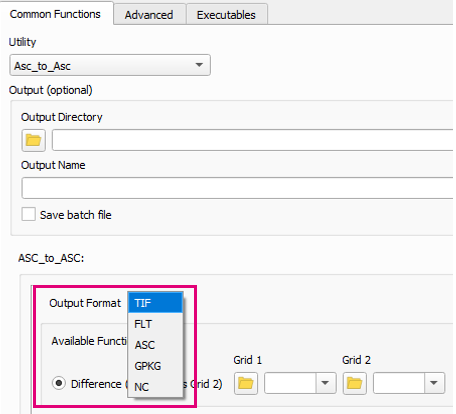

### Increment Layer

##### Adds New GPKG Option to Save Superseded Version Out
{: .fs-4 : .fw-700}

A new option to save the superseded GPKG layer out into a new database. This prevents the necessity of creating a copy of a GPKG each time a layer is incremented.

For more information, please visit the following TUFLOW wiki page: 
[Increment Layer - Save Layer Into Superseded Folder](https://wiki.tuflow.com/QGIS_TUFLOW_Increment_Layer#Save_Layer_Out_Into_Superseded_Folder)

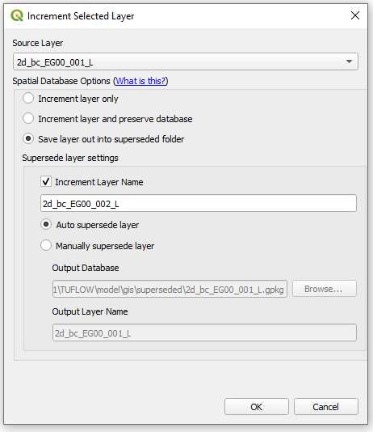

### Configure Project

##### Dialog Will No Longer Close on Error
{: .fs-4 : .fw-700}

The dialog will no longer close if an error occurs while running the Configure TUFLOW Project tool.

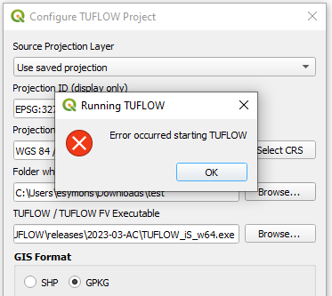

## Bug Fixes

### TUFLOW Viewer

* Load results from TCF - Handles encoding errors
* Fixes 1D xs viewing when using a GPKG layer
* No longer recognised 1d_bc as a 1d_tab type
* Fixes Minimum dt display in QGIS 3.30 - now should correctly display as only one result type
* Fixes bug that would not load 1D results correctly on project load
* Fixes bug that could retain feature selection in layers that were removed or otherwise deselected
* Fixes a bug with plotting 1D cross-sections that would cause them to be plotted even though the 'XZ' type was not selected
* Fixes a bug with plotting 1D cross-sections that would stop them from being plotted after switching to a different plotting tab then coming back to the cross-section plotting tab
* Fixes a bug that would not plot cross-section hydraulic tables if the 1d_xs and source CSV were in different folders
* Fixes a bug that could cause switching between results to be really slow if multiple 1D results were loaded at the same time
* NetCDF grids are now correctly saved / loaded in qgis project
* Fixes 'Move down' option when there are only 2 results open
* Fixes python error that could occur if selecting channel results when another open result only contains 2D PO results
* Fixes grammatical error in batch export map tool successful message box
* Fixes python error that could occur when batch exporting plots when data was of different lengths

### Other

* Load Layers From TCF - Encoding errors when reading TUFLOW control files are now ignored.
* Correctly unloads a few tools so that plugin can be upgraded/removed properly
* 1D Integrity Tool - Fixes X connectors not being properly handled when using flow trace tool
* 1D Integrity Tool - Fixes spelling mistake in Continuity Tool description
* Import Empty - Fixes bug that would cause 'convert to database' always to be checked when QGIS is first opened - now correctly remembers previous setting between sessions
* Increment Layer Tool - Fixes bug that would update a layer's name in layer panel but not the data source if an incremented layer had duplicates in the project
* Increment Layer Tool - Fixes bug that would display "|layername=" for shp files after using 'import from tcf' tool
* Convert TUFLOW Model GIS Format - Fixes bug that would not correctly convert TCF commands prefixed with '1D'
* Convert TUFLOW Model GIS Format - Fixes a bug that would cause the tool to not bring in all layers if a scenario name had a decimal point in the name (e.g. If Scenario == 2.5m)
* Configure Project - Fixes bug that would not cancel tool after user cancel request
