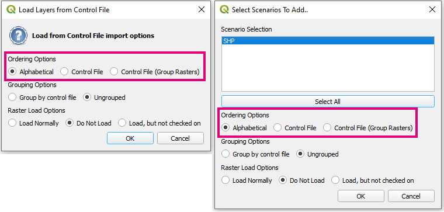
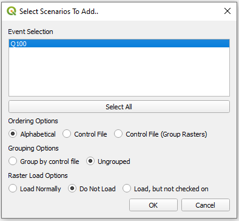
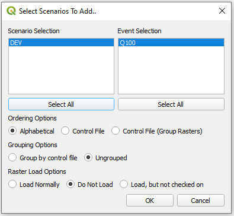
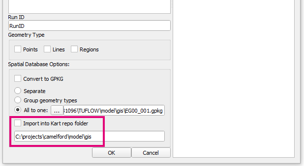

# Changelog for TUFLOW Plugin v3.8.2

* TOC
{:toc}

<!--
<video style="max-width:640px" controls>
  <source src="assets/test.mp4" type="video/mp4">
</video>
-->

## New Features and Enhancements

### Load Layers From TCF

##### New Option to Load Layers Sorted by Control File
{: .fs-4 : .fw-700}

The tool now supports sorting layer by control rather than alphabetically. This allows users to see layer priority as it exists in TUFLOW. An option also exists to group raster layers separately to the vector layers.

##### If Event Logic Captured
{: .fs-4 : .fw-700}

Layers that sit inside "<tt>If Event == </tt>" logic blocks now are treated the same as scenario blocks.

##### Visual Change - Keep Selection Highlighted Blue
{: .fs-4 : .fw-700}

Selection highlighting stays blue even when the widget hasn't got the focus (previously the selection would become grey). This allows better visual representation when both scenario and event options are present.

### Import Empty

##### Adds Import to Kart Option
{: .fs-4 : .fw-700}

Option to import empty layers into Kart repository. Import empty checks for the existance of Kart and gives the option only if it is available.

## Bug Fixes

### TUFLOW Viewer

* Fixes bug that could cause strange plotting behaviour when 1D/2D results were both loaded and the reference time was changed for the 2D results 
* Fixes an issue where TUFLOW Viewer was not always picking up 1d_xs layers from GPKG
* Fixes bug that would sometimes not show all available groundwater PO outputs
* Fixes bug that could cause python error when trying to close a result just after TUFLOW is started overrided the same result layer

### Other

* Load from TCF - Fixes bug that could cause a load error if the output folder was a Windows path variable
* Load From TCF - MIF layers with 2 geometry types will now correctly load in line types which could sometimes not load in correctly
* ReFH2 to TUFLOW - Fixes tool not initialising correctly when plugin is loaded which was causing 'unexpected' error when the tool was opened by user
* Arch Bridge Editor - fixes bug that would not recognise GPKG input layers as 1d_nwk
* 1D Integrity Tool - fixes python error that could occur if no points where included when running the snapping tool
* 1D Integrity Tool - Fixes bug that could cause python error due to non-unique indexing internally
* Increment Layer - Fixes a bug that would lead to strange autofilled increment names (or python errors) when the source layer name was using letters along side version number e.g. '002b'
* Configure Project - Updates to latest vector file creation functions in QGIS. Projection.shp causes error in QGIS 3.30
