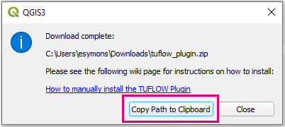
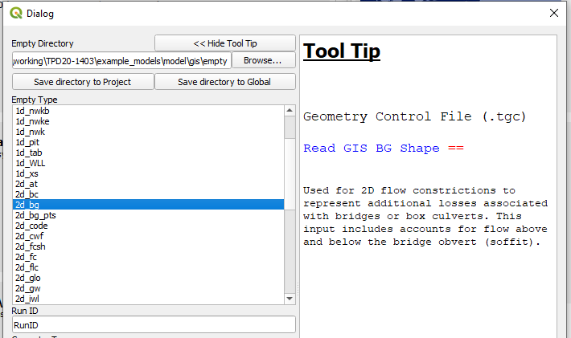
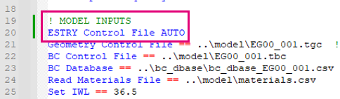
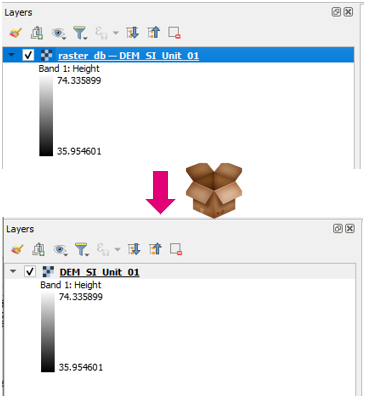
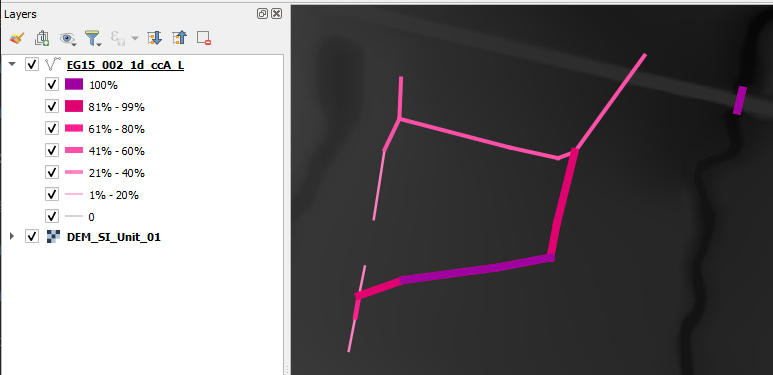
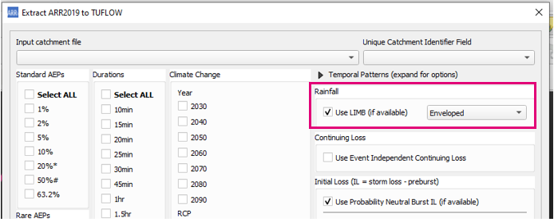

# Changelog for TUFLOW Plugin v3.9

* TOC
{:toc}

<a href="../index.md">home</a>

<!--
<video style="max-width:640px" controls>
  <source src="videos/test.mp4" type="video/mp4">
</video>
-->

## New Features and Enhancements

### TUFLOW Viewer

#### Support for 2d_bc_tables_check.csv

TUFLOW Viewer now supports loading and viewing the 2d_bc_tables_check.csv file. Once imported, the boundary feature can be selected from the input GIS layer (e.g. 2d_bc, 2d_sa) and plotted using the Time Series plot and selecting an appropriate result type. The boundary input type requires a unique ID to be able to link the check file with the feature (i.e. HQ boundaries do not work as these are automatically generated and do not use the ID attribute).

Link to TUFLOW Wiki Documentation: 
[TUFLOW Viewer - Import 2D BC Tables](https://wiki.tuflow.com/TUFLOW_Viewer_-_Import_2D_BC_Tables)

#### User Defined Time Formatting in Animation Export

The animation export now supports user defined time formatting for the time label. The format follows the Python time formatting convention as described at the following link: 
[https://docs.python.org/3/library/datetime.html#strftime-and-strptime-format-codes](https://docs.python.org/3/library/datetime.html#strftime-and-strptime-format-codes)

#### Flood Modeller Result Shown on Cross-Sections With the Same Name

Flood modeller results can now be shown on cross-section even if they don't intersect the created PLOT_P points if they have the same name as a result node.

### ReFH2 to TUFLOW

#### Support for FEH2022 Rainfall

The FEH2022 rainfall model is now supported in the RefH2 to TUFLOW tool.

### TUFLOW Plugin Downloader

#### Copy Path to Clipboard Button

Adds button to the finish dialog that will copy the download path to the clipboard (so that it can easily be pasted into the "Install from ZIP" plugin installation option).

### Import Empty

#### Missing Empty Types Added for Tooltips

Adds new/missing empty types to the empty tooltips (2d_bg, 1d_bg, 1d_lc).

### TUFLOW Context Menu - Layers Panel

Adds a "TUFLOW" context menu when a layer is right-clicked in the Layers Panel. The provided options are dependent on the selected layer (e.g. if it is a SHP or GPKG, or some layers get extra commands like the messages_P output).

The tools below have been added to the context menu options.

#### Increment Layer (Layer Context Menu)

Adds a new increment layer tool to the layer context menu. Similar to the existing increment layer tool however the dialog will be different depending on the option selected in the context menu. By adding context to the dialog, the available options in the increment tool can be limited and the dialog will be far less complicated and busy.

E.g. depending on the format, the options will be:

* SHP option - Increment File
* GPKG option - Increment Layer and Database (create a new GPKG to increment layers into)
* GPKG option - Increment Layer (increment layer inside the existing GPKG)

And the resulting dialog will be dependent on the selected option.

#### Filter Messages by ID

Adds Filter Message by ID to the TUFLOW context menu for messages_P layers.

#### Copy TUFLOW Command

Adds 'Copy TUFLOW Command' tool to TUFLOW context menu. This tool will create a TUFLOW command based on the GIS layer name. From the layer name, the command and control file it belongs in will be inferred. The tool will do a search for the control file within the directory structure (based on the GIS file location), otherwise if the control file is not found, the standard location of the control file will be used.

Multiple layers can be selected at once. If applicable, the command will be combined to a single line (e.g. for 2d_zsh) else separate commands will be created with line breaks.

<video style="max-width:640px" controls>
  <source src="assets/copy_tuflow_command.mp4" type="video/mp4">
</video>

### TUFLOW Utilities

#### GPKG Raster Support

GPKG rasters now available and supported in the relevant 'Common Functions' drop down boxes.

### Load Layers From TCF

#### Support for Old Auto Estry Command

Older style 'ESTRY Control File AUTO' syntax now supported (previously only 'ESTRY Control File == AUTO' worked).

### Apply GPKG Layer Names

#### Support for GPKG Rasters

GPKG rasters now supported.

### TUFLOW Layer Styling

#### Support ccA_L Result File

_ccA_L result file now has default styling.

### ARR to TUFLOW

#### Support for LIMB Data

Option add to process and use LIMB data will if available.

#### Remove Longitude Limit

Removes longitude limit (>153.2999). Previously this limit was in place as data was missing beyond this point.

### Increment Layer

#### User Check Before Overwriting Existing Layers

Adds user check when overwriting an existing layer in a GPKG.

### Processing Toolbox

#### Import Empty (Processing Toolbox)

A new version of the import empty tool has been added to the TUFLOW processing toolbox. This has been done as this is probably the correct location for the import empty tool and also allows a spring clean to remove legacy code and backward compatibility to old QGIS versions.

#### Create Project (Processing Toolbox)

A new version of the Create TUFLOW Project tool has been added to the TUFLOW processing toolbox. This has been done as this is probably the correct location for this tool and also allows a spring clean to remote legacy code and backward compatibility to old QGIS versions.

## Bug Fixes

### TUFLOW Viewer

* Time series results are now loaded correctly using 'utf-8' encoding which enables handling of special characters
* Loading NetCDF Grids will now try and load all selected layers before reporting errors
* Results with only maximums will now appear in relevant plot menus
* Fixes loading netCDF raster as mesh
* XS deactivation was only working when using the MAT approach
* Loading mesh layers on when TUFLOW Viewer is opened was getting tangled if layers of different types (vector layers / mesh layers) had the same name
* Fixes flood modeller result cross-sections not loading when X,Y coordinate did not contain a space between them in DAT file
* Fixes animations with embedded plots not working in QGIS 3.30
* Fixes bug introduced in 3.8.2 that prevented NetCDF grid results from being loaded (produced python error about missing 'events' argument)

### Other

* TUFLOW Utilities - Fixes bug in asc_to_asc brkline tool where the vector layer was being passed into the utility instead of the raster layer
* TUFLOW Utilities - Fixes bug where no 'browse' buttons were working
* TUFLOW Utilities - Downloader was hanging indefinitely due to a python error on a separate thread in QGIS 3.32 (caused by new numpy version)
* Configure Project - Fixes bug that would not correctly save empty file location for TUFLOW FV
* TUFLOW Styling - Fixes default styling for sac_check_R
* TUFLOW Styling - ISIS 1d_nwk layers are now given a single styling previously would cause python error because they are not guaranteed to have the standard 1d_nwk fields
* Convert Model GIS Format - Fixes bug that cause new filepaths to be incorrect when convert filename that were only a number (e.g. 001.tgc)
* Load from TCF - fixes bug that would not load layers if brackets were included in file path
* Load from TCF - fixes issue that would cause a python error if there was a '\|' at the end of a GIS input command
